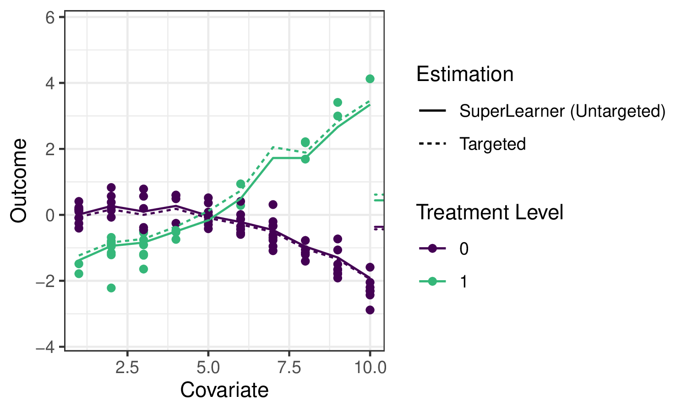
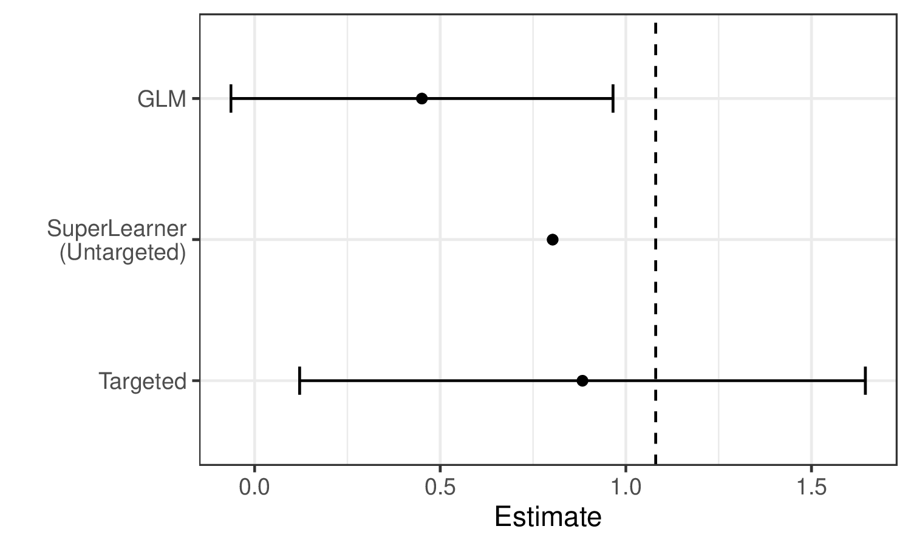

```{r setup-common, include=FALSE}
source("_common.R")
```
# TMLE 프레임워크 {#tmle3}

_Jeremy Coyle_

[`tmle3` `R` 패키지](https://github.com/tlverse/tmle3)를 바탕으로 합니다.

::: {.callout-note}
## 학습 목표

이 장을 마치면 여러분은 다음을 할 수 있게 됩니다.

1. 효과 추정을 위해 왜 TMLE를 사용하는지 이해합니다.
2. `tmle3`를 사용하여 평균 치료 효과(ATE)를 추정합니다.
3. `tmle3` "Specs" 객체 사용법을 이해합니다.
4. 사용자 정의 타겟 파라미터 세트에 대해 `tmle3`를 적합시킵니다.
5. 델타 방법(delta method)을 사용하여 타겟 파라미터의 변환을 추정합니다.
:::

## 소개 {#tmle-intro}

`sl3`에 관한 이전 장에서 데이터로부터 $\mathbb{E}[Y \mid X]$와 같은 회귀 함수를 추정하는 방법을 배웠습니다. 그것은 데이터로부터 배우는 중요한 첫 번째 단계이지만, 이 예측 모델을 사용하여 통계적 및 인과적 효과를 어떻게 추정할 수 있을까요?

[타겟 러닝을 위한 로드맵](#roadmap)으로 돌아가서, 치료 변수 $A$가 결과 $Y$에 미치는 효과를 추정하고 싶다고 가정해 봅시다. 논의한 바와 같이, 그 효과를 특성화하는 하나의 잠재적 파라미터는 평균 치료 효과(ATE)이며, 이는 $\psi_0 = \mathbb{E}_W[\mathbb{E}[Y \mid A=1,W] - \mathbb{E}[Y \mid A=0,W]]$로 정의됩니다. 또한 공변량 $W$의 분포에 대해 평균을 냈을 때 치료 $A=1$과 $A=0$ 하에서의 평균 결과 차이로 해석됩니다. 우리는 다음 예제 데이터를 사용하여 이 파라미터에 대한 몇 가지 잠재적 추정기를 설명하고 TMLE(타겟 최대 가능도 추정; 타겟 최소 손실 기반 추정) 프레임워크의 사용 동기를 부여할 것입니다.

```{r tmle_fig1, results="asis", echo = FALSE}
knitr::include_graphics("img/png/schematic_1_truedgd.png")
```

오른쪽의 작은 눈금은 각각 $A=1$과 $A=0$ 하에서의 평균 결과($W$에 대해 평균을 냄)를 나타내며, 따라서 그들의 차이가 우리가 추정하고자 하는 양입니다.

이 장에서 TMLE의 적용 동기를 부여하기를 바라지만, 전체 기술적 세부 사항에 대해서는 두 권의 타겟 러닝 서적과 관련 저작물을 참고하시기 바랍니다.

## 대입 추정기 (Substitution Estimators) {#substitution-est}

우리는 `sl3`를 사용하여 슈퍼 러너 또는 다른 회귀 모델을 적합시켜 결과 회귀 함수 $\mathbb{E}_0[Y \mid A,W]$를 추정할 수 있습니다. 우리는 이를 종종 $\overline{Q}_0(A,W)$라고 부르며 그 추정치를 $\overline{Q}_n(A,W)$로 표시합니다. ATE 추정치 $\psi_n$을 구성하려면, 두 중재 대조에서 평가된 $\overline{Q}_n(A,W)$의 추정치를 해당 ATE "플러그인" 공식에 "대입(plug-in)"하기만 하면 됩니다: $\psi_n = \frac{1}{n}\sum(\overline{Q}_n(1,W)-\overline{Q}_n(0,W))$. 이러한 종류의 추정기를 _플러그인_ 또는 _대입_ 추정기라고 부릅니다. 파라미터 $\psi_0$의 정확한 추정치 $\psi_n$은 관련 회귀 함수 $\overline{Q}_0(A,W)$ 자체에 대한 추정치 $\overline{Q}_n(A,W)$를 대입함으로써 얻어질 수 있기 때문입니다.

예제에서 결과 회귀를 추정하기 위해 `sl3`를 적용하면, 앙상블 기계 학습 예측이 데이터를 꽤 잘 적합시키는 것을 볼 수 있습니다.

```{r tmle_fig2, results="asis", echo = FALSE}

```

실선은 회귀 함수에 대한 `sl3` 추정치를 나타내며, 점선은 [아래에서 설명할](#tmle-updates) `tmle3` 업데이트를 나타냅니다.

대입 추정기는 직관적이지만, $\overline{Q}_0(A,W)$의 슈퍼 러너 추정치와 함께 이 접근 방식을 순진하게 사용하는 것에는 몇 가지 한계가 있습니다. 첫째, 슈퍼 러너는 우리가 추정하고자 하는 ATE 파라미터를 "타겟팅"하는 대신 전체 회귀 함수에 걸쳐 리스크를 최소화하도록 학습자 가중치를 선택하고 있으며, 이는 편향된 추정으로 이어집니다. 즉, `sl3`는 오른쪽의 작은 눈금에 집중하는 대신 왼쪽의 전체 회귀 곡선에서 잘하려고 노력하고 있습니다. 더욱이 이 접근 방식의 샘플링 분포는 점근적으로 선형이 아니며, 따라서 추론이 불가능합니다.

우리는 예제 데이터에 대해 생성된 추정치에서 이러한 한계가 설명된 것을 볼 수 있습니다.

```{r tmle_fig3, results="asis", echo = FALSE}

```

슈퍼 러너가 GLM보다 참 파라미터 값(수직 점선으로 표시됨)을 더 정확하게 추정하는 것을 볼 수 있습니다. 그러나 여전히 TMLE보다는 덜 정확하며 유효한 추론이 불가능합니다. 반면에 TMLE는 편향이 적은 추정기와 유효한 추론을 달성합니다.

## 타겟 최대 가능도 추정 (TMLE) {#tmle}

TMLE는 초기 추정치 $\overline{Q}_n(A,W)$뿐만 아니라 성향 점수의 추정치 $g_n(A \mid W) = \mathbb{P}(A = 1 \mid W)$를 가져와서 관심 파라미터에 "타겟팅된" 업데이트된 추정치 $\overline{Q}^{\star}_n(A,W)$를 생성합니다. TMLE는 대입 추정기의 장점을 유지하면서도(대입 추정기 중 하나임), 원래의 잠재적으로 불규칙한 추정치를 보강하여 _편향을 수정_하는 동시에, 점근적으로 일관된 Wald 스타일 신뢰 구간을 통한 추론을 수용하는 _점근적 선형_(따라서 정규 분포를 따름) 추정기를 결과로 냅니다.

### TMLE 업데이트 {#tmle-updates}

TMLE에는 여러 유형이 있으며(때로는 동일한 타겟 파라미터 세트에 대해 여러 개가 있기도 함), 아래에 ATE의 TML 추정을 위한 알고리즘의 예를 제시합니다. $\overline{Q}^{\star}_n(A,W)$는 TMLE 보강 추정치 $f(\overline{Q}^{\star}_n(A,W)) = f(\overline{Q}_n(A,W)) + \epsilon \cdot H_n(A,W)$입니다. 여기서 $f(\cdot)$은 적절한 링크 함수(예: $\text{logit}(x) = \log(x / (1 - x))$)이며, "영리한 공변량(clever covariate)" $H_n(A,W)$의 계수 $\epsilon$에 대한 추정치 $\epsilon_n$이 계산됩니다. 공변량 $H_n(A,W)$의 형태는 타겟 파라미터마다 다릅니다. ATE의 경우 $H_n(A,W) = \frac{A}{g_n(A \mid W)} - \frac{1-A}{1-g_n(A, W)}$입니다. 여기서 $g_n(A,W) = \mathbb{P}(A=1 \mid W)$는 추정된 성향 점수이므로, 추정기는 결과 회귀($\overline{Q}_n$)와 성향 점수($g_n$)의 초기 적합(`sl3`에 의한) 모두에 의존합니다.

과적합 편향을 피하기 위해 추가적인 교차 검증 계층을 사용하는 것(즉, CV-TMLE)뿐만 아니라 여러 파라미터를 동시에 더 일관되게 추정하기 위한 접근 방식(예: 생존 곡선의 지점들)을 포함하여 `tlverse` 전반에서 사용되는 몇 가지 견고한 보강 방법이 있습니다.

### 통계적 추론 {#tmle-infer}

TMLE는 **점근적 선형** 추정기를 생성하므로 통계적 추론을 얻는 것이 매우 편리합니다. 각 TML 추정기에는 추정기의 점근적 분포를 설명하는 대응하는 **(효율적) 영향 함수**(종종 줄여서 "EIF")가 있습니다. 추정된 EIF를 사용함으로써, 우리의 초기 추정치 $\overline{Q}_n$과 $g_n$을 EIF의 형태에 대입한 다음 샘플 표준 오차를 계산함으로써 Wald 스타일 추론(점근적으로 정확한 신뢰 구간)을 간단히 구축할 수 있습니다.

다음 섹션에서는 `tlverse`에서 TMLE를 지정하고 추정하는 간단한 방법과 더 자세한 방법을 모두 설명합니다. `tmle3`를 설계하면서 우리는 TMLE의 매우 일반적인 추정 프레임워크를 가능한 한 가깝게 복제하고자 노력했으며, 따라서 TMLE와 관련된 각 이론적 객체는 대응하는 소프트웨어 객체/메서드로 인코딩되어 있습니다. 먼저 WASH Benefits 예제에 `tmle3`를 간단히 적용한 모습을 제시한 다음, 기저 객체들에 대해 더 자세히 설명하겠습니다.

## 간단한 예제: ATE를 위한 `tmle3`

앞서 소개한 WASH Benefits 데이터를 사용하고 평균 치료 효과를 추정하여 TMLE의 가장 기본적인 사용법을 설명하겠습니다.

### 데이터 로드

이전 장과 동일한 WASH Benefits 데이터를 사용하겠습니다.

```{r tmle3-load-data}
library(data.table)
library(dplyr)
library(tmle3)
library(sl3)
washb_data <- fread(
  paste0(
    "https://raw.githubusercontent.com/tlverse/tlverse-data/master/",
    "wash-benefits/washb_data.csv"
  ),
  stringsAsFactors = TRUE
)
```

### 변수 역할 정의

일반적인 $W$(공변량), $A$(치료/중재), $Y$(결과) 데이터 구조를 사용하겠습니다. `tmle3`는 데이터셋의 어떤 변수가 이러한 각 역할에 해당하는지 알아야 합니다. 이를 알려주기 위해 문자열 벡터의 리스트를 사용합니다. 우리는 이를 변수들 사이의 인과 관계를 표시하는 방법인 유향 비순환 그래프(DAG)의 노드에 대응하므로 "노드 리스트(Node List)"라고 부릅니다.

```{r tmle3-node-list}
node_list <- list(
  W = c(
    "month", "aged", "sex", "momage", "momedu",
    "momheight", "hfiacat", "Nlt18", "Ncomp", "watmin",
    "elec", "floor", "walls", "roof", "asset_wardrobe",
    "asset_table", "asset_chair", "asset_khat",
    "asset_chouki", "asset_tv", "asset_refrig",
    "asset_bike", "asset_moto", "asset_sewmach",
    "asset_mobile"
  ),
  A = "tr",
  Y = "whz"
)
```

### 누락성 처리

현재 `tmle3`에서 누락성은 상당히 간단한 방식으로 처리됩니다.

* 누락된 공변량은 중앙값(연속형의 경우) 또는 최빈값(이산형의 경우)으로 대체되며, [`sl3` 장](#sl3)에서 설명한 대로 대체되었음을 나타내는 추가 공변량이 생성됩니다.
* 누락된 치료 변수는 제외됩니다 --- 그러한 관찰값은 삭제됩니다.
* 누락된 결과는 _역 검쇄 확률 가중치(inverse probability of censoring weights, IPCW)_의 자동 계산(및 추정기에 통합)을 통해 효율적으로 처리됩니다. 이는 IPCW-TMLE로도 알려져 있으며 누락을 제거하기 위한 합동 중재로 생각할 수 있으며 고전적인 역 확률 가중 추정기에서 사용되는 절차와 유사합니다.

이러한 단계는 `tmle3`의 `process_missing` 함수에 구현되어 있습니다.

```{r tmle3-process_missing}
processed <- process_missing(washb_data, node_list)
washb_data <- processed$data
node_list <- processed$node_list
```

### "Spec" 객체 생성

`tmle3`는 일반적이며 TMLE 절차의 대부분의 구성 요소를 모듈식 방식으로 지정할 수 있게 해줍니다. 그러나 대부분의 사용자는 이러한 모든 구성 요소를 수동으로 지정하는 데 관심이 없을 것입니다. 따라서 `tmle3`는 일련의 구성 요소를 _사양(specification)_("Spec")으로 묶는 `tmle3_Spec` 객체를 구현하며, 최소한의 추가 세부 사항만으로 TMLE를 적합시키기 위해 실행될 수 있습니다.

먼저 스펙 중 하나를 사용하는 것부터 시작하여 `tmle3`의 내부로 들어가 보겠습니다.

```{r tmle3-ate-spec}
ate_spec <- tmle_ATE(
  treatment_level = "Nutrition + WSH",
  control_level = "Control"
)
```

### 학습자 정의

현재 사용자가 정의해야 하는 유일한 다른 사항은 가능도의 관련 인자들인 Q와 g를 추정하는 데 사용되는 `sl3` 학습자들입니다.

이는 `sl3` 적합을 통해 추정될 각 가능도 인자당 하나씩, `sl3` 학습자들의 리스트 형태를 취합니다.

```{r tmle3-learner-list}
# 기본 학습자 선택
lrnr_mean <- make_learner(Lrnr_mean)
lrnr_rf <- make_learner(Lrnr_ranger)

# 데이터 유형에 적합한 메타 학습자 정의
ls_metalearner <- make_learner(Lrnr_nnls)
mn_metalearner <- make_learner(
  Lrnr_solnp, metalearner_linear_multinomial,
  loss_loglik_multinomial
)
sl_Y <- Lrnr_sl$new(
  learners = list(lrnr_mean, lrnr_rf),
  metalearner = ls_metalearner
)
sl_A <- Lrnr_sl$new(
  learners = list(lrnr_mean, lrnr_rf),
  metalearner = mn_metalearner
)
learner_list <- list(A = sl_A, Y = sl_Y)
```

여기서는 이전 장에서 정의한 것과 같은 슈퍼 러너를 사용합니다. 향후에는 합리적인 기본 학습자들을 포함할 계획입니다.

### TMLE 적합

이제 `tmle3`를 사용하여 tmle를 적합시키는 데 필요한 모든 것이 준비되었습니다.

```{r tmle3-spec-fit}
tmle_fit <- tmle3(ate_spec, washb_data, node_list, learner_list)
print(tmle_fit)
```

### 추정치 평가

적합 객체를 프린트하여 요약 결과를 볼 수 있습니다. 또는 다음과 같이 요약 결과를 인덱싱하여 결과를 추출할 수 있습니다.
```{r tmle3-spec-summary}
estimates <- tmle_fit$summary$psi_transformed
print(estimates)
```

## `tmle3` 구성 요소

스펙을 사용하여 TML 추정치를 성공적으로 얻었으므로 이제 구성 요소들을 살펴보겠습니다. 스펙에는 TMLE를 정의하고 적합시키는 데 필요한 객체들을 생성하는 여러 함수가 있습니다.

### `tmle3_task`

첫 번째는 `sl3_Task`와 유사한 `tmle3_Task`로, TMLE를 적합시키려는 데이터와 위에서 정의된 `node_list`에서 생성된 변수 및 그들의 관계를 설명하는 NPSEM을 포함합니다.

```{r tmle3-spec-task}
tmle_task <- ate_spec$make_tmle_task(washb_data, node_list)
```

```{r tmle3-spec-task-npsem}
tmle_task$npsem
```

### 초기 가능도 (Initial Likelihood)

다음은 위에서 설명한 NPSEM에 따라 인수 분해된 가능도를 나타내는 객체입니다.

```{r tmle3-spec-initial-likelihood}
initial_likelihood <- ate_spec$make_initial_likelihood(
  tmle_task,
  learner_list
)
print(initial_likelihood)
```

가능도의 이러한 구성 요소들은 인자들이 어떻게 추정되었는지 나타냅니다. $W$의 주변 분포는 NP-MLE를 사용하여 추정되었고, $A$와 $Y$의 조건부 분포는 위에서 `learner_list`로 정의한 `sl3` 적합을 사용하여 추정되었습니다.

이를 `tmle_task` 객체와 함께 사용하여 각 관찰값에 대한 가능도 추정치를 얻을 수 있습니다.
```{r tmle3-spec-initial-likelihood-estimates}
initial_likelihood$get_likelihoods(tmle_task)
```

<!-- TODO: 적합 객체에서 학습자를 꺼내는 도우미 만들기 -->

### 타겟팅된 가능도 (업데이터)

또한 "타겟팅된 가능도(Targeted Likelihood)" 객체를 정의해야 합니다. 이는 `tmle3_Update` 객체를 사용하여 업데이트될 수 있는 특수한 유형의 가능도입니다. 이 객체는 업데이트 전략(예: 서브모델, 손실 함수, CV-TMLE 사용 여부)을 정의합니다.

```{r tmle3-spec-targeted-likelihood}
targeted_likelihood <- Targeted_Likelihood$new(initial_likelihood)
```

타겟팅된 가능도를 구축할 때 서로 다른 업데이트 옵션을 지정할 수 있습니다. 다양한 옵션에 대한 자세한 내용은 `tmle3_Update` 문서를 참조하십시오. 예를 들어, 다음과 같이 CV-TMLE(`tmle3`의 기본값)를 비활성화할 수 있습니다.

```{r tmle3-spec-targeted-likelihood-no-cv}
targeted_likelihood_no_cv <-
  Targeted_Likelihood$new(initial_likelihood,
    updater = list(cvtmle = FALSE)
  )
```

### 파라미터 매핑

마지막으로 관심 있는 파라미터를 정의해야 합니다. 여기서 스펙은 단일 파라미터인 ATE를 정의합니다. 다음 섹션에서는 추가 파라미터를 추가하는 방법을 살펴보겠습니다.

```{r tmle3-spec-params}
tmle_params <- ate_spec$make_params(tmle_task, targeted_likelihood)
print(tmle_params)
```

### 모든 것을 하나로 묶기

스펙을 사용하여 이러한 모든 구성 요소를 수동으로 생성했으므로 이제 `tmle3`를 수동으로 적합시킬 수 있습니다.

```{r tmle3-manual-fit}
tmle_fit_manual <- fit_tmle3(
  tmle_task, targeted_likelihood, tmle_params,
  targeted_likelihood$updater
)
print(tmle_fit_manual)
```

결과는 위에서와 같이 `tmle3` 함수를 사용하여 적합시킨 것과 동일합니다.

## 여러 파라미터를 사용하여 `tmle3` 적합시키기

위에서는 단 하나의 파라미터를 사용하여 `tmle3`를 적합시켰습니다. `tmle3`는 여러 파라미터를 동시에 적합시키는 것도 지원합니다. 이를 설명하기 위해 `tmle_TSM_all` 스펙을 사용하겠습니다.

```{r tmle3-tsm-all}
tsm_spec <- tmle_TSM_all()
targeted_likelihood <- Targeted_Likelihood$new(initial_likelihood)
all_tsm_params <- tsm_spec$make_params(tmle_task, targeted_likelihood)
print(all_tsm_params)
```

이 스펙은 노출 변수의 각 수준에 대해 치료 특정 평균(Treatment Specific Mean, TSM)을 생성합니다. 이전 가능도는 ATE에 타겟팅되었으므로 먼저 새로운 타겟팅된 가능성을 생성해야 함에 유의하십시오. 그러나 위에서 적합시킨 초기 가능도는 재사용할 수 있으므로 슈퍼 학습자 단계를 절약할 수 있습니다.

### 델타 방법 (Delta Method)

우리는 또한 다른 파라미터의 델타 방법 변환에 기초하여 파라미터를 정의할 수 있습니다. 예를 들어, 델타 방법과 위의 두 TSM 파라미터를 사용하여 ATE를 추정할 수 있습니다.

```{r tmle3-delta-method-param}
ate_param <- define_param(
  Param_delta, targeted_likelihood,
  delta_param_ATE,
  list(all_tsm_params[[1]], all_tsm_params[[4]])
)
print(ate_param)
```

이는 상대 위험도(Relative Risks) 및 모집단 귀속 위험도(Population Attributable Risks)와 같은 다른 파생 파라미터를 추정하는 데에도 유사하게 사용될 수 있습니다.

### 적합

이제 위에서 정의된 ATE 파라미터뿐만 아니라 모든 TSM 파라미터에 대해 동시에 TMLE를 적합시킬 수 있습니다.

```{r tmle3-tsm-plus-delta}
all_params <- c(all_tsm_params, ate_param)

tmle_fit_multiparam <- fit_tmle3(
  tmle_task, targeted_likelihood, all_params,
  targeted_likelihood$updater
)

print(tmle_fit_multiparam)
```

## 연습 문제

::: {.callout-tip title="연습 문제 1: tmle3를 사용한 ATE 추정"}
`sl3` 패키지에서 제공하는 Collaborative Perinatal Project(CPP) 데이터를 사용하여 평균 치료 효과를 추정하려면 아래 단계를 따르십시오. 이 예제를 단순화하기 위해, 이진 중재 변수 `parity01`(현재 아이 이전에 한 명 이상의 자녀가 있는지 여부를 나타내는 지표)과 이진 결과 변수 `haz01`(연령 대비 신장이 평균 이상인지 여부를 나타내는 지표)을 정의합니다.

```{r tmle-exercise-data}
# 데이터셋 로드
data(cpp)
cpp <- cpp %>%
  as_tibble() %>%
  dplyr::filter(!is.na(haz)) %>%
  mutate(
    parity01 = as.numeric(parity > 0),
    haz01 = as.numeric(haz > 0)
  )
```

1. 이러한 노드들의 리스트를 생성하여 변수 역할 $(W,A,Y)$을 정의합니다. $W$에 다음 기본 공변량들을 포함하십시오: `apgar1`, `apgar5`, `gagebrth`, `mage`, `meducyrs`, `sexn`. $A$와 $Y$는 모두 위에서 지정되었습니다. 데이터의 누락성(특히 노드 리스트에 지정된 열의 누락)을 처리해야 합니다. 위의 `washb_data` 예제와 같이 `process_missing` 함수를 사용하여 이를 수행할 수 있습니다.
2. ATE를 위한 `tmle3_Spec` 객체인 `tmle_ATE()`를 정의합니다.
3. 위에서 정의된 것과 동일한 기본 학습 라이브러리를 사용하여, $\overline{Q}_0 = \mathbb{E}_0(Y \mid A, W)$ 및 $g_0 = \mathbb{P}(A = 1 \mid W)$ 추정을 위한 `sl3` 기본 학습자들을 지정합니다.
4. 아래와 같이 메타 학습자를 정의합니다.

```{r, metalrnr-exercise}
metalearner <- make_learner(
  Lrnr_solnp,
  loss_function = loss_loglik_binomial,
  learner_function = metalearner_logistic_binomial
)
```

5. $\overline{Q}_0$ 추정을 위한 슈퍼 러너 하나와 $g_0$ 추정을 위한 슈퍼 러너 하나를 정의합니다. 두 슈퍼 러너 모두에 대해 위의 메타 학습자를 사용하십시오.
6. 이전 단계에서 정의된 두 슈퍼 러너의 리스트를 생성하고 이 객체를 `learner_list`라고 부릅니다. 리스트 이름은 `A`($g_0$ 추정을 위한 슈퍼 러너 정의)와 `Y`($\overline{Q}_0$ 추정을 위한 슈퍼 러너 정의)여야 합니다.
7. (1) 2단계에서 정의한 `tmle3_Spec`, (2) 데이터, (3) 1단계에서 지정한 노드 리스트, (4) 6단계에서 정의한 $g_0$ 및 $\overline{Q}_0$ 추정을 위한 슈퍼 러너 리스트를 지정하여 `tmle3` 함수로 TMLE를 적합시킵니다. *참고*: 이전과 마찬가지로 (`cpp2 <- data.table::copy(cpp)`)와 같이 데이터의 복본을 명시적으로 만들어야 하며, 이후에는 `cpp2` 데이터를 사용하십시오.
:::

## 요약

`tmle3`는 TML 추정치를 생성하기 위한 범용 프레임워크입니다. 이를 사용하는 가장 쉬운 방법은 미리 정의된 스펙을 사용하는 것이며, 데이터, 변수 역할 및 `sl3` 학습자만 채우면 됩니다. 그러나 내부를 파고들면 사용자가 최적 치료 및 확률적 이동 중재와 같은 고급 파라미터를 추정하는 광범위한 TMLE를 지정할 수 있습니다. 다음 섹션에서는 이 프레임워크가 최적 치료 및 확률적 이동 중재와 같은 고급 파라미터를 추정하는 데 어떻게 사용될 수 있는지 살펴보겠습니다.
