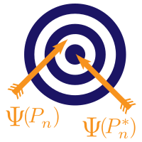

```{r setup, include=FALSE}
source("_common.R")
```

# 환영합니다 

`R`을 활용한 타겟 러닝: `tlverse` 소프트웨어 생태계를 이용한 인과 데이터 과학_은 [`tlverse` 생태계](https://github.com/tlverse)에서 제공하는 소프트웨어 스택을 사용하여 타겟 러닝 방법론을 실무에 적용하기 위한 완전 재현 가능한 오픈 소스 전자 핸드북입니다. 이 저작물은 현재 초안 단계에 있으며, 커뮤니티의 의견을 수렴하기 위해 공개되어 있습니다. 내용을 확인하거나 기여하시려면 [GitHub 저장소](https://github.com/tlverse/tlverse-handbook)를 방문해 주세요.




<br><br><br><br>

# 개요 

이 핸드북은 타겟 러닝 방법론과 [`tlverse` 소프트웨어 생태계](https://github.com/tlverse)를 활용하여 인과 추론 및 기계 학습을 수행하는 일련의 예제와 튜토리얼을 제공하기 위해 작성되었습니다. 타겟 러닝 프레임워크에 대한 더 심도 있는 배경 지식이 필요하시다면, ["Targeted Learning: Causal Inference for Observational and Experimental Data"](https://doi.org/10.1007/978-1-4419-9782-1) (van der Laan & Rose, 2011) 및 ["Targeted Learning in Data Science: Causal Inference for Complex Longitudinal Studies"](https://doi.org/10.1007/978-3-319-65304-4) (van der Laan & Rose, 2018) 서적을 참고하시기 바랍니다.

# 라이선스 

&copy; 2017--2024 [Nima Hejazi](https://nimahejazi.org).

[`tlverse` 핸드북](https://tlverse.org/tlverse-handbook)은 [Creative Commons Attribution 4.0 International License](http://creativecommons.org/licenses/by/4.0/) 하에 라이선스가 부여되었습니다.

[](http://creativecommons.org/licenses/by/4.0/)
